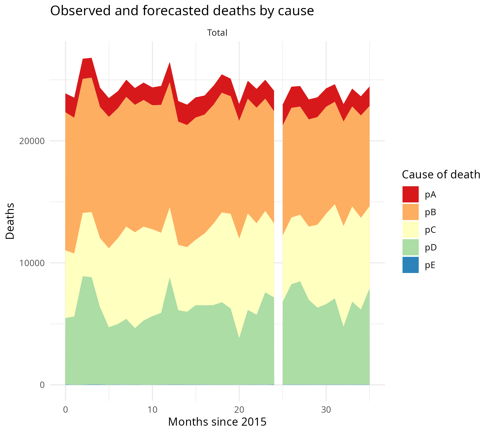

# XCOD: Estimate expected and excess deaths by cause using coherent compositional regression

[Jonas Schöley](https://orcid.org/0000-0002-3340-8518)

Predict time-series of expected deaths by cause from past data, using a compositional data modeling approach.

A vector of death counts by cause $j = 1, \ldots, k$ at time $t$, $\mathbf{D}^{(j)}_t = (D_t^1, \ldots, D_t^k)^\mathrm{T}$, is modeled as the product of total expected deaths, $\lambda_t$, and a vector of cause-specific expected proportions on all deaths, $\mathbf{p}^{(j)}_t$,

$$
\mathbf{D}^{(j)}_t = \lambda_t\mathbf{p}^{(j)}_t \times \exp \left( \mathbf{u}^{(j)}\right),
$$

with $\mathbf{u} \sim \mathcal{N}_k(0, \mathbf{\Sigma})$ being a vector of multivariate-normal distributed residuals capturing the dependencies across causes of death at a single point in time.

In order to achieve robust and speedy estimates, and to allow for the specification of a separate model for total expected deaths, the data is fitted in a three-step procedure. 

First, the expected total deaths at time t, $\lambda_t$, are predicted via Poisson regression as a log-linear function of time, featuring both a long-term trend and a cyclical seasonal component:

$$
D_t \sim \mathrm{Pois}(\lambda_t) \\
\lambda_t = \exp \left( \beta_0 + \beta_t t + s(t; \boldsymbol{\beta}_s) \right),
$$

where $\beta_t$ is the slope of a log-linear long-term trend and $s(t; \boldsymbol{\beta}_s)$ is a cyclical function of time $t$ to capture seasonality.

Second, compositional regressions are fitted to estimate the expected proportion of cause-specific deaths on all deaths. Specifically, the cause-specific proportions, transformed via the centered-log-ratio, are expressed as a linear function of time,

$$
\mathrm{clr}_j(p^{j}_t) = \gamma_0^j + \gamma_t^j t + s(t; \boldsymbol{\gamma}_s^j),
$$

with $p^{j}_t$ being the $j^\textrm{th}$ element of $\mathbf{p}_t$ and $\mathrm{clr}_j = \left( \frac {p^j_t} {g(\mathbf{p}_t)} \right)$, where $g(\mathbf{p}_t) = \sqrt[k]{\prod^k p^j_t}$ is the geometric mean over the proportions at a given time.

